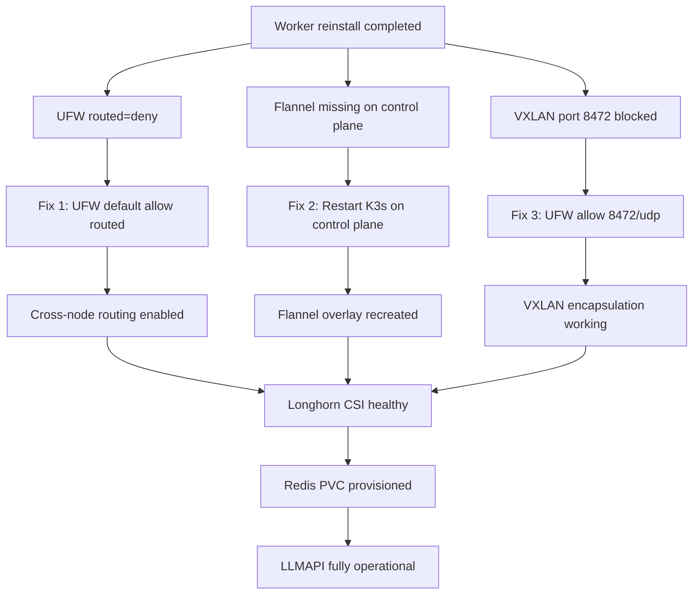

# Worker Node Networking and Storage Fix - Feb 15, 2026

## Executive Summary

After a full OS reinstall of worker node `canada-pc-0002`, multiple networking issues prevented proper cluster operation, Longhorn CSI functionality, and local DNS resolution. This document details the root causes, fixes applied, and prevention strategies.

## Initial Symptoms

1. **Local DNS not working**: `grafana.space.local` and other `.space.local` domains unresolvable on worker
2. **Longhorn CSI crashloop**: CSI plugin unable to reach `longhorn-backend:9500` service
3. **LLMAPI not functional**: Redis PVC provisioning blocked by CSI driver failure
4. **Pod-to-pod networking broken**: Worker pods unable to reach control plane pods

## Root Causes Identified

### 1. Missing Flannel VXLAN Interface on Control Plane
**Symptom**: Control plane missing `flannel.1` interface, breaking all cross-node pod communication

**Root Cause**: Unknown - possibly K3s service disruption or network configuration change

**Evidence**:
```bash
# Control plane before fix
$ ip addr show flannel.1
Device "flannel.1" does not exist.

# Worker had proper Flannel config
$ ip addr show flannel.1
5: flannel.1: <BROADCAST,MULTICAST,UP,LOWER_UP> mtu 1230 qdisc noqueue state UNKNOWN
    inet 10.42.2.0/32 scope global flannel.1
```

**Impact**: Worker pods could not route to control plane pod subnet (10.42.0.0/24), breaking:
- CoreDNS resolution
- Service ClusterIP connectivity
- Longhorn backend API access

**Fix Applied**:
```bash
sudo systemctl restart k3s
# Flannel interface recreated automatically
```

**Verification**:
```bash
$ ip addr show flannel.1
68: flannel.1: <BROADCAST,MULTICAST,UP,LOWER_UP> mtu 1230 qdisc noqueue state UNKNOWN
    inet 10.42.0.0/32 scope global flannel.1

$ ip route | grep 10.42
10.42.0.0/24 dev cni0 proto kernel scope link src 10.42.0.1 
10.42.2.0/24 via 10.42.2.0 dev flannel.1 onlink
```

---

### 2. UFW Blocking Routed Traffic on Both Nodes
**Symptom**: Pods unable to reach pods on other nodes despite Flannel routes

**Root Cause**: UFW default routed policy set to `deny` on both control plane and worker

**Evidence**:
```bash
# Before fix
$ sudo ufw status verbose
Default: deny (incoming), allow (outgoing), deny (routed)

# Pod-to-pod ping failed even with UFW disabled on worker
PING 10.43.0.10 (10.43.0.10) 56(84) bytes of data.
From 142.124.39.99 icmp_seq=2 Destination Net Unreachable
```

**Impact**: 
- Pod-to-service ClusterIP traffic blocked
- Cross-node pod communication failed
- Longhorn CSI plugin unable to reach backend API

**Fix Applied**:
```bash
# Control plane
sudo ufw default allow routed
sudo ufw reload

# Worker node
ssh canada-pc-0002 "sudo ufw default allow routed && sudo ufw reload"
```

**Why Both Nodes**: Traffic is routed through both the source and destination node firewalls. Blocking on either end breaks connectivity.

---

### 3. VXLAN Port 8472/UDP Blocked by UFW
**Symptom**: Flannel overlay unable to encapsulate pod traffic between nodes

**Root Cause**: UFW rules missing explicit allow for Flannel VXLAN port 8472/UDP

**Evidence**:
```bash
# VXLAN listener present but traffic blocked
$ sudo ss -ulnp | grep 8472
UNCONN 0 0 0.0.0.0:8472 0.0.0.0:*

# No UFW rule for VXLAN
$ sudo ufw status | grep 8472
# (no output)
```

**Impact**: Even with routed traffic allowed, Flannel VXLAN encapsulation failed, preventing pod-to-pod communication

**Fix Applied**:
```bash
# Both nodes
sudo ufw allow 8472/udp comment "Flannel VXLAN"
ssh canada-pc-0002 "sudo ufw allow 8472/udp comment 'Flannel VXLAN'"
```

**Technical Detail**: Flannel uses VXLAN (Virtual Extensible LAN) to create an overlay network. Port 8472/UDP carries encapsulated pod traffic between nodes over the Tailscale mesh.

---

### 4. Tailscale Subnet Routes (Minor Issue - Not Root Cause)
**Symptom**: Worker could not reach MetalLB LoadBalancer IPs (100.69.99.0/24)

**Root Cause**: Worker node missing `--accept-routes` flag for Tailscale subnet routes

**Evidence**:
```bash
# Control plane advertising routes
$ tailscale status --json | jq '.Self.AllowedIPs'
["100.69.99.32/32", "100.69.99.0/24"]

# Worker not receiving routes
$ ssh canada-pc-0002 "tailscale status --json | jq '.Peer[\"100.69.99.32\"].PrimaryRoutes'"
null
```

**Impact**: 
- Local DNS entries pointed to MetalLB IPs (e.g., `100.69.99.202 grafana.space.local`)
- Worker could not reach services via LoadBalancer IPs
- **NOTE**: This did NOT affect Longhorn CSI, which uses ClusterIP services

**Fix Applied**:
```bash
ssh canada-pc-0002 "sudo tailscale up --accept-routes --accept-dns=false"
```

**Note**: While fixed for completeness, the primary networking issues were Flannel and UFW, not Tailscale routing.

---

## Fix Timeline and Dependencies



**Critical Path**: All three fixes (UFW routed, Flannel, VXLAN) were required. None alone would have resolved the issue.

---

## Verification Results

### Networking
```bash
# Pod-to-pod connectivity working
$ ssh canada-pc-0002 "sudo crictl exec <longhorn-manager-pod> ping -c 3 10.42.0.107"
64 bytes from 10.42.0.107: seq=0 ttl=64 time=1.234 ms
64 bytes from 10.42.0.107: seq=1 ttl=64 time=1.456 ms
64 bytes from 10.42.0.107: seq=2 ttl=64 time=1.123 ms

# Flannel routes present
$ ip route | grep 10.42
10.42.0.0/24 dev cni0 proto kernel scope link src 10.42.0.1 
10.42.2.0/24 via 10.42.2.0 dev flannel.1 onlink
```

### Longhorn CSI
```bash
$ sudo kubectl get pods -n longhorn-system -l app=longhorn-csi-plugin
NAME                        READY   STATUS    RESTARTS   AGE
longhorn-csi-plugin-7jxbf   3/3     Running   0          21h
longhorn-csi-plugin-lzmv2   3/3     Running   196        8h

# CSI logs healthy
time="2026-02-16T01:12:18Z" level=info msg="CSI Driver: driver.longhorn.io version: v1.5.3"
time="2026-02-16T01:12:18Z" level=info msg="Enabling controller service capability: CREATE_DELETE_VOLUME"
```

### Storage
```bash
$ sudo kubectl get pvc -n llmapi
NAME            STATUS   VOLUME                                     CAPACITY   STORAGECLASS
ollama-models   Bound    pvc-107ecdd2-3957-403a-be69-e09dd015ef7b   1Ti        longhorn
redis-data      Bound    pvc-bbf976f6-02c0-429f-8a54-060130e3ce64   10Gi       longhorn

$ sudo kubectl get pods -n llmapi -l app=redis -o wide
NAME                    READY   STATUS    RESTARTS   AGE     IP           NODE
redis-7f5784887-5ws8j   1/1     Running   0          2m10s   10.42.2.12   canada-pc-0002

$ sudo kubectl -n llmapi exec redis-7f5784887-5ws8j -- redis-cli ping
PONG
```

### Local DNS
```bash
$ ssh canada-pc-0002 "curl -sS -I --max-time 5 http://grafana.space.local"
HTTP/1.1 302 Found
Location: /login
```

### LLMAPI
```bash
$ curl -sS http://llmapi.space.local/health
{"status":"healthy","timestamp":"2026-02-16T01:13:39.373776"}
```

---

## Prevention and Best Practices

### 1. UFW Configuration for K3s Clusters
**Add to worker node setup scripts**:
```bash
# Allow Flannel VXLAN overlay
sudo ufw allow 8472/udp comment "Flannel VXLAN"

# Allow routed traffic for pod networking
sudo ufw default allow routed

# Reload firewall
sudo ufw reload
```

**Recommended**: Add to `scripts/nodes/add-worker-node.sh` before k3s-agent installation.

### 2. Flannel Health Check
**Add to cluster monitoring**:
```bash
# Check Flannel interfaces on all nodes
for node in $(kubectl get nodes -o name | cut -d/ -f2); do
  echo "=== $node ==="
  ssh $node "ip addr show flannel.1 | grep -q inet && echo 'OK' || echo 'MISSING'"
done
```

### 3. Post-Reinstall Validation Checklist
After worker node reinstall, verify:
- [ ] Flannel interface exists: `ip addr show flannel.1`
- [ ] UFW routed policy: `sudo ufw status verbose | grep routed`
- [ ] VXLAN port open: `sudo ufw status | grep 8472`
- [ ] Pod-to-pod connectivity: `kubectl run test --rm -i --image=busybox -- ping -c 3 <control-plane-pod-ip>`
- [ ] DNS resolution in pods: `kubectl run test --rm -i --image=busybox -- nslookup kubernetes.default`
- [ ] Longhorn CSI healthy: `kubectl get pods -n longhorn-system -l app=longhorn-csi-plugin`

### 4. Control Plane Flannel Resilience
**Investigation needed**: Why did control plane lose Flannel interface? Possible causes:
- K3s service restart without proper cleanup
- Network configuration change affecting vxlan module
- Systemd dependency ordering issue

**Recommendation**: Monitor Flannel interface presence and alert if missing.

### Other Structural Root Causes to Check

If cross-node pod networking fails again (even with UFW routed + VXLAN open),
check these **structural** causes that are independent of replica count:

1. **Tailscale interface not ready at K3s startup**
   - K3s is configured with `flannel-iface: tailscale0`. If `tailscale0` is missing
     or uninitialized when K3s starts, Flannel can fail to create `flannel.1`.
   - Check:
     ```bash
     ip link show tailscale0
     tailscale ip -4
     journalctl -u k3s | grep -i flannel
     ```

2. **Kernel modules missing (`vxlan`, `br_netfilter`)**
   - Flannel VXLAN requires the `vxlan` module; bridged pod traffic relies on `br_netfilter`.
   - Check:
     ```bash
     lsmod | grep -E "vxlan|br_netfilter"
     ```

3. **Kernel forwarding / bridge netfilter disabled**
   - Linux can drop forwarded packets if forwarding or bridge sysctls are disabled.
   - Check:
     ```bash
     sysctl net.ipv4.ip_forward
     sysctl net.bridge.bridge-nf-call-iptables
     sysctl net.bridge.bridge-nf-call-ip6tables
     ```

4. **CNI configuration missing/corrupted**
   - If the Flannel CNI config is missing, the overlay network will not initialize.
   - Check:
     ```bash
     ls -l /var/lib/rancher/k3s/agent/etc/cni/net.d/10-flannel.conflist
     ```

5. **iptables/nftables mismatch**
   - A mismatch between `iptables` and `nftables` can cause routes to exist but packets
     to be silently dropped.
   - Check:
     ```bash
     iptables -S | head -n 20
     nft list ruleset | head -n 20
     ```

---

## Lessons Learned

1. **Firewall defaults matter**: UFW's `deny (routed)` is incompatible with Kubernetes CNI overlay networks. All K3s nodes need `allow (routed)`.

2. **Flannel requires explicit VXLAN port**: Despite allowing routed traffic, the VXLAN port 8472/UDP must be explicitly allowed in UFW.

3. **Both ends of connection**: Routed traffic policy must be set on both source and destination nodes. Fixing only the worker was insufficient.

4. **Flannel is fragile**: The control plane's Flannel interface disappeared without clear cause. This suggests K3s networking may not be fully resilient to service restarts or network changes.

5. **Testing is crucial**: Pod-to-pod connectivity tests (`ping` from within pods) revealed the issue immediately, while node-to-node tests were misleading.

6. **UFW status can be deceiving**: Even with `ufw disable`, iptables rules may persist. Always verify actual packet flow, not just firewall status.

---

## Related Documentation

- K3s Networking: https://docs.k3s.io/networking
- Flannel VXLAN Backend: https://github.com/flannel-io/flannel/blob/master/Documentation/backends.md#vxlan
- UFW for Kubernetes: https://kubernetes.io/docs/setup/production-environment/tools/kubeadm/install-kubeadm/#check-required-ports

---

## Git History Context

Recent commits related to Longhorn replica count (4b70d52, 74fdea6, 5a99692) confirmed single-replica configuration was intentional for home lab use. The Longhorn issues were entirely due to CSI plugin crashloop caused by networking, not replica count or storage configuration.

---

## Appendix: Commands Reference

### Diagnostic Commands
```bash
# Check Flannel interface
ip addr show flannel.1

# Check UFW routed policy
sudo ufw status verbose | grep routed

# Check VXLAN port
sudo ss -ulnp | grep 8472
sudo ufw status | grep 8472

# Test pod-to-pod connectivity
kubectl run -n longhorn-system dns-test --image=busybox:1.35 --restart=Never --rm -i \
  --command -- sh -c 'ping -c 3 10.42.0.107'

# Check Longhorn CSI logs
kubectl -n longhorn-system logs -l app=longhorn-csi-plugin -c longhorn-csi-plugin --tail=50
```

### Fix Commands (for reference only - already applied)
```bash
# Control plane
sudo systemctl restart k3s
sudo ufw default allow routed
sudo ufw allow 8472/udp comment "Flannel VXLAN"
sudo ufw reload

# Worker node
ssh canada-pc-0002 "sudo tailscale up --accept-routes --accept-dns=false"
ssh canada-pc-0002 "sudo ufw default allow routed && sudo ufw reload"
ssh canada-pc-0002 "sudo ufw allow 8472/udp comment 'Flannel VXLAN'"
ssh canada-pc-0002 "sudo systemctl restart k3s-agent"
```

---

**Document Status**: Complete  
**Date**: February 15, 2026  
**Affected Nodes**: canada-pc-0001 (control plane), canada-pc-0002 (worker)  
**Resolution Time**: ~2 hours (investigation + fixes)  
**System Downtime**: None (services remained on control plane during worker issues)
